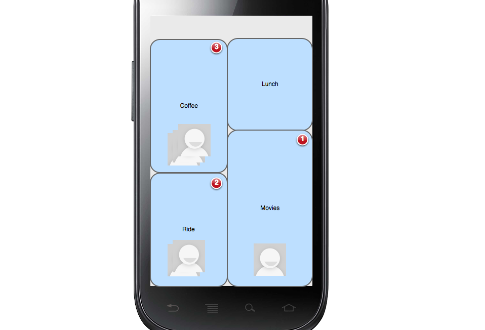

Connect
=======
The idea of this project is to connect people with actions instead of messages. Here is the brief description of the app

The app should have some list of predetermined actions that the users wants to do and if he selects any of the action and if any of his/her friends who has the app installed select the same action, both will be notified.

e.g: Say User 1 wants to go to Coffee but doesn't have a company or hesitant to ask anyone for a coffee.
 User 2, who is on User 1's friends list also selects coffee within a pre set time from user 1 action. Then we will pair these two actions and notify the users.
 
 The idea is to have a bunch of pre listed actions and different logics. 
 
 The app will have integrations with facebook, linked in, twitter to get friends list. In addtion, we can use phone number or email address to sign up.
 
 Some list of pre set actions that i was thinking in no particular order.
 
Wanna go Coffee?
Hungry, Let's eat!
Need Help!
Want to Help!
Wanna go Movie?

Let us know your thoughts and we don't know how complex this project would be but we are more than happy to strecth to give this a shot.

User Stories

User Stories:-

1.  Login screen- User Name and Password
2. After Login, the user should see the list of the activities that he wants to do. Go to Coffee, Go to movie,..etc
3. If the user selects any activity, register the activity in the backend and then keep that request active for 30 minutes and if someone else in his friends group select the same activity he has selected then notify the user.
4. If there are multiple active requests that match the user request, then display a pop up with the friends list who selected that activity and give the user an option to select the one he/she wants to go with or give them an option to go with all or few of them.
5. The user flow should be like below

Login -> Select any activity you want to do(request will be active for 30 mins)-> Someone in friends list select the same activity as the user did-> Notify each of them about the match and ask if they are interested-> Give them an option to meet, Busy, Tentative.

Optional:

Have a History, where we store all the previous activities (successfully completed ones) and have an option to share via Twitter, Facebook
Have a way to login via Phone number and authenticate using the code

